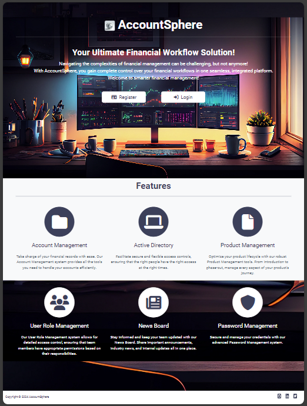
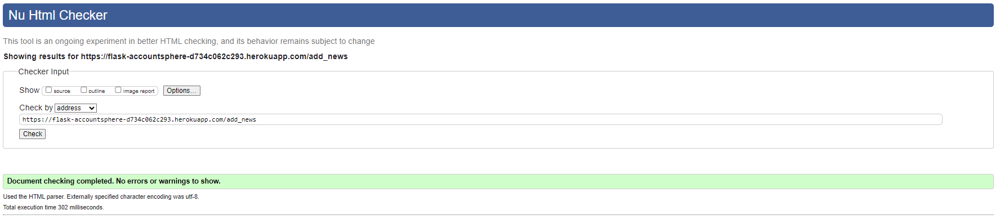
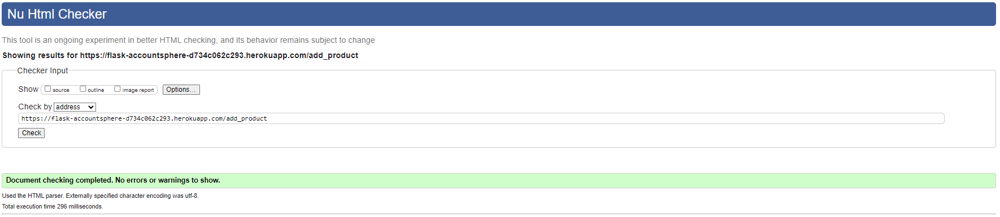
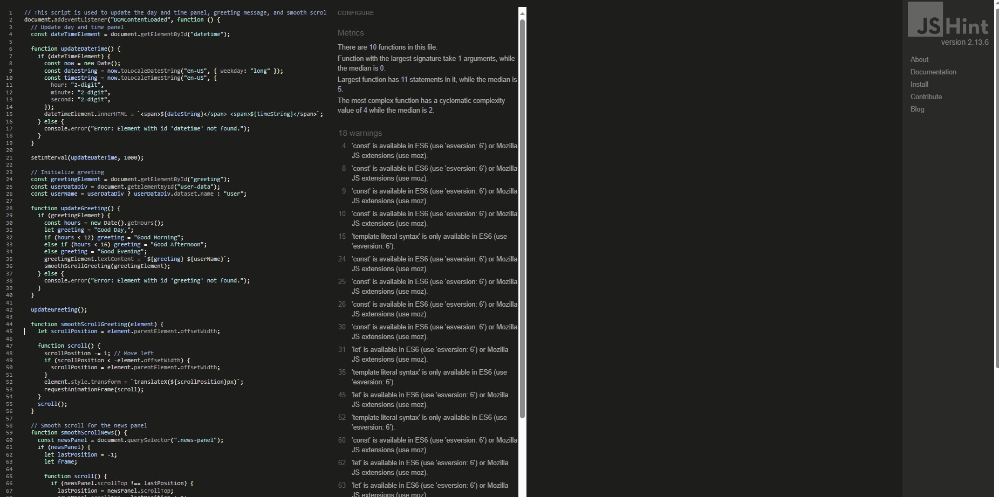

# AccountSphere - Testing

Visit the deployed site: [AccountSphere](https://flask-accountsphere-d734c062c293.herokuapp.com/)

- - -

## CONTENTS

* [Manual Testing](#manual-testing)
   - [RBAC Security Testing](#rbac-security-testing)
   - [Feature Testing](#feature-testing)
   - [User Story Testing](#user-story-testing)
   - [Browser Compatibility](#browser-compatibility)
   - [Responsiveness Testing](#responsiveness-testing)
* [Automated Testing](#automated-testing)
  - [Code Validation](#code-validation)
  - [Lighthouse Performance Assessment](#lighthouse-performance-assessment)

Throughout the development process, Chrome Developer Tools and other browser tools have been employed to identify and resolve issues promptly. This involved monitoring console logs, diagnosing JavaScript and Python errors, and ensuring consistent styles across browsers.

To ensure responsiveness across multiple screen sizes and devices, every page was tested using Chrome Developer Tools and Microsoft Edge Inspector.

- - -
## MANUAL TESTING 

### RBAC Security Testing

Role-Based Access Control (RBAC) is a critical aspect of my application, ensuring that users can only access resources that they are authorised to view or modify based on their roles. This section outlines the manual testing process used to verify that access controls are correctly enforced.

#### `Overview`

Manual testing was conducted to ensure that different user roles have appropriate access to resources. The testing process involved simulating actions from users of various roles and verifying access restrictions.

#### `Test Setup`

Before starting the manual testing, the following steps were completed:

1. **Setup Test Accounts**: User accounts for each role in the application were created (e.g., Administrator, Account Officer, News Analyst, Product Manager), with typical permissions assigned to each role.
2. **Test Data**: The application was populated with sufficient data to test various functionalities (e.g., user management, account management).
3. **Testing Environment**: A dedicated testing environment was set up to mirror the production settings without affecting live data.

#### `Test Cases`

| Test Case                        | Objective                                                               | Steps                                                                                                                                      | Expected Result                                                                                                      | Snapshot                                     |
|----------------------------------|-------------------------------------------------------------------------|--------------------------------------------------------------------------------------------------------------------------------------------|----------------------------------------------------------------------------------------------------------------------|----------------------------------------------|
| **Administrator Access**         | Verify access to all sections                                           | 1. Log in as an Administrator. 2. Navigate to each section (User Management, AD Groups, Account Management, News Board, Product Management). 3. Verify access. | Administrator can access all sections and perform all administrative functions.                                      |   |
| **Account Officer Access**       | Ensure access only to Account Management                                | 1. Log in as an Account Officer. 2. Access Account Management. 3. Attempt to access other sections (User Management, AD Groups, News Board, Product Management). | Access to Account Management is granted; access to other sections is denied.                                         |  |
| **News Analyst Access**          | Ensure access only to News Board                                        | 1. Log in as a News Analyst. 2. Access the News Board. 3. Attempt to access other sections (Account Management, Product Management).  | Access to News Board is granted; access to other sections is denied.                                                 |  |
| **Product Manager Access**       | Verify access only to Product Management                                | 1. Log in as a Product Manager. 2. Access Product Management. 3. Attempt to access other administrative areas (User Management).      | Access to Product Management is granted; access to other sections is denied.                                         |  |
| **General Security Checks**      | Test for URL manipulation and unauthorised access through direct entry  | 1. Log in with one role and note accessible URLs. 2. Log out and log in with a different role. 3. Attempt to access noted URLs directly. | Unauthorized access attempts are blocked, and appropriate access denials are enforced.                               |  |
| **Administrator Deletion Access**| Ensure only administrators can delete any resources                     | 1. Log in as an Administrator and navigate to any section with delete functionality (e.g., User Management, Account Management). 2. Perform delete actions.  3. Log in as another role and attempt to perform delete actions. | Only administrators can successfully delete resources; other roles except the News Analyst role are denied access to delete functionality.        |  |
| **Protecting Admin Rights**      | Ensure the 'Administrator' role is not selectable during registration   | 1. Navigate to the registration form. 2. Verify that the 'Administrator' role is not listed in the role selection dropdown. 3. Attempt to manually set the role to 'Administrator' through form manipulation. | The 'Administrator' role is not available for selection; attempts to bypass are prevented.                           |  |

#### `Test Results`

All test scenarios were executed successfully, and the following results were observed:

- **Administrator Access**: Administrators were able to access all sections and perform all administrative functions without any issues.
- **Account Officer Access**: Account Officers were able to access Account Management but were restricted from accessing User Management, AD Groups, News Board, and Product Management.
- **News Analyst Access**: News Analysts were able to access the News Board but were restricted from accessing other sections like Account and Product Management.
- **Product Manager Access**: Product Managers were able to access Product Management but were restricted from accessing User Management and other administrative areas.
- **General Security Checks**: Attempts to manipulate URLs or access unauthorized sections resulted in appropriate access denials.
- **Administrator Deletion Access**: Only administrators were able to perform delete actions across the application; other roles were denied access to delete functionality.
- **Protecting Admin Rights**: The 'Administrator' role was successfully excluded from the registration form, and attempts to bypass this restriction were prevented.

#### `Conclusion`

The manual testing of RBAC was successfully completed, ensuring that each user role can only access its authorised resources and that only administrators can perform delete actions. This thorough testing confirms that the RBAC implementation is robust and correctly restricts access based on user roles.

#### `Administrator Role Protection`

To protect the administrator role from being selected by public users during registration, it is excluded from the list of roles presented in the registration form. This is done by filtering out the 'Administrator' role from the available options.

#### `Role Required Decorator`

The `role_required` decorator is used to restrict access to certain routes based on the user's role. It checks if the current user is authenticated and if their role is within the allowed roles for that route.

- - -
### Feature Testing

Each feature was tested to ensure seamless user interactions, proper form validation, intuitive navigation, and functional features. Testing involved verifying accuracy, reliability, and usability.

#### `Login Page`

| **Description** | **Functionality** | **Test Steps** | **Expected Result** | **Actual Result** | **Status** | **Snapshot** |
|-----------------|-------------------|----------------|----------------------|------------------|------------|--------------|
| Verify login form | Login Form | Load the login page   Enter credentials   Submit | Redirects to the profile page | Redirects to the profile page | Pass |  |

#### `Registration Page`

| **Description** | **Functionality** | **Test Steps** | **Expected Result** | **Actual Result** | **Status** | **Snapshot** |
|-----------------|-------------------|----------------|----------------------|------------------|------------|--------------|
| Verify registration form | Registration Form | Load the registration page   Enter user details   Submit | Registers new user and redirects to login page | Registers new user and redirects to login page | Pass |  |

#### `Profile Page`

| **Description**                              | **Functionality**            | **Test Steps**                                                            | **Expected Result**                         | **Actual Result**                          | **Status** | **Snapshot**                                                      |
|----------------------------------------------|------------------------------|--------------------------------------------------------------------------|---------------------------------------------|--------------------------------------------|------------|--------------------------------------------------------------------|
| Verify profile greeting                      | Profile Greeting             | Navigate to the profile page   Check for personalised greeting        | Displays personalised greeting              | Displays personalised greeting             | Pass       |  |
| Verify navigation links                      | Navigation Links             | Click each navigation link   Observe page redirection                 | Each link redirects to the correct page     | Each link redirects to the correct page    | Pass       |  |
| Verify Home button functionality             | Home Button                  | Click the Home button on the profile page                               | Redirects to the home/dashboard page        | Redirects to the home/dashboard page       | Pass       |           |
| Verify News Panel Display                    | News Panel Display           | Scroll through the news panel   Check for news item visibility        | All news items are visible and scrollable   | All news items are visible and scrollable  | Pass       |             |
| Verify dynamic greeting update               | Dynamic Greeting Update      | Visit the profile page at different times of the day                     | Greeting updates based on the time of day    | Greeting updates based on the time of day   | Pass       |  |
| Verify functional responsiveness             | Profile Page Responsiveness  | View the profile page on different devices and orientations              | Page layout adjusts appropriately            | Page layout adjusts appropriately           | Pass       |  |
| Verify smooth scrolling in the news panel    | Smooth Scrolling             | Use the mouse or touchpad to scroll through the news panel               | Smooth and uninterrupted scrolling experience | Smooth and uninterrupted scrolling experience | Pass       |  |

#### `Account Management Page`

| **Description**                               | **Functionality**            | **Test Steps**                                                                                 | **Expected Result**                               | **Actual Result**                                | **Status** | **Snapshot**                                                               |
|-----------------------------------------------|------------------------------|------------------------------------------------------------------------------------------------|-------------------------------------------------|-------------------------------------------------|------------|-------------------------------------------------------------------------|
| Verify account management functionality       | Account Management           | Navigate to the account management page   Create, update, and delete accounts               | Manages accounts correctly                        | Manages accounts correctly                       | Pass       |  |
| Verify account search functionality           | Account Search               | Use the search bar to find specific accounts by name or email                                  | Accounts matching search criteria are displayed  | Accounts matching search criteria are displayed | Pass       |          |
| Verify form validation during account creation| Form Validation              | Attempt to create an account with invalid data                                                 | Displays appropriate validation error messages   | Displays appropriate validation error messages   | Pass       |        |
| Verify responsiveness of the account page     | Account Page Responsiveness  | View the account management page on various devices and orientations                           | Layout adjusts appropriately                       | Layout adjusts appropriately                      | Pass       |   |

#### `AD Group Management Page`

| **Description**                               | **Functionality**            | **Test Steps**                                                                                  | **Expected Result**                               | **Actual Result**                                | **Status** | **Snapshot**                                                             |
|-----------------------------------------------|------------------------------|------------------------------------------------------------------------------------------------|-------------------------------------------------|-------------------------------------------------|------------|-------------------------------------------------------------------------|
| Verify AD group management functionality      | AD Group Management           | Navigate to the AD group management page   Create, update, delete AD groups                  | Manages AD groups correctly                        | Manages AD groups correctly                       | Pass       |  |
| Verify search functionality for AD groups     | AD Group Search               | Use the search bar to find specific AD groups                                                   | Groups matching search criteria are displayed     | Groups matching search criteria are displayed    | Pass       |          |
| Verify form validation during AD group creation| Form Validation              | Attempt to create an AD group with invalid data                                                 | Displays appropriate validation error messages   | Displays appropriate validation error messages   | Pass       |        |
| Verify responsiveness of the AD group page    | AD Group Page Responsiveness  | View the AD group management page on various devices and orientations                           | Layout adjusts appropriately                       | Layout adjusts appropriately                       | Pass       |   |

#### `Product Management Page`

| **Description**                            | **Functionality**           | **Test Steps**                                                                                  | **Expected Result**                              | **Actual Result**                               | **Status** | **Snapshot**                                                             |
|--------------------------------------------|-----------------------------|------------------------------------------------------------------------------------------------|------------------------------------------------|------------------------------------------------|------------|-------------------------------------------------------------------------|
| Verify product management functionality   | Product Management          | Navigate to the product management page   Create, update, delete products                    | Manages products correctly                        | Manages products correctly                       | Pass       |  |
| Verify search functionality for products  | Product Search              | Use the search bar to find specific products                                                    | Products matching search criteria are displayed   | Products matching search criteria are displayed | Pass       |          |
| Verify form validation during product creation| Form Validation            | Attempt to create a product with invalid data                                                   | Displays appropriate validation error messages   | Displays appropriate validation error messages  | Pass       |        |
| Verify responsiveness of the product page | Product Page Responsiveness | View the product management page on various devices and orientations                            | Layout adjusts appropriately                      | Layout adjusts appropriately                      | Pass       |   |

#### `User Board Page`

| **Description**                           | **Functionality**           | **Test Steps**                                                                                  | **Expected Result**                               | **Actual Result**                                | **Status** | **Snapshot**                                                         |
|-------------------------------------------|-----------------------------|------------------------------------------------------------------------------------------------|-------------------------------------------------|-------------------------------------------------|------------|---------------------------------------------------------------------|
| Verify user board functionality          | User Board                  | Navigate to the user board page   Create, update, delete users                               | Manages users correctly                           | Manages users correctly                           | Pass       |         |
| Verify search functionality for users    | User Search                 | Use the search bar to find specific users                                                       | Users matching search criteria are displayed      | Users matching search criteria are displayed      | Pass       |       |
| Verify responsiveness of the user page   | User Page Responsiveness    | View the user board page on various devices and orientations                                   | Layout adjusts appropriately                       | Layout adjusts appropriately                       | Pass       |  |

#### `News Board Page`

| **Description** | **Functionality** | **Test Steps** | **Expected Result** | **Actual Result** | **Status** | **Snapshot** |
|-----------------|-------------------|----------------|----------------------|------------------|------------|--------------|
| Verify news board functionality | News Board | Navigate to the news board page   Create, update, delete news items | Manages news items correctly | Manages news items correctly | Pass |  |

#### `Password Reset Page`

| **Description** | **Functionality** | **Test Steps** | **Expected Result** | **Actual Result** | **Status** | **Snapshot** |
|-----------------|-------------------|----------------|----------------------|------------------|------------|--------------|
| Verify password reset functionality | Password Reset | Load the password reset page   Enter existing password   Enter new password   Confirm new password   Update | Changes Password | Changes Password | Pass |  |

#### `Logout Functionality`

| **Description** | **Functionality** | **Test Steps** | **Expected Result** | **Actual Result** | **Status** | **Snapshot** |
|-----------------|-------------------|----------------|----------------------|------------------|------------|--------------|
| Verify logout functionality | Logout | Navigate to the logout Icons   Click logout button | Logs out and redirects to welcome page | Logs out and redirects to welcome page | Pass |  |

#### `Error Pages`

| **Description** | **Functionality** | **Test Steps** | **Expected Result** | **Actual Result** | **Status** | **Snapshot** |
|-----------------|-------------------|----------------|----------------------|------------------|------------|--------------|
| Verify 404 page functionality | 404 Page | Load a non-existent page | Displays custom 404 page | Displays custom 404 page | Pass |  |

- - -

### User Story Testing

To verify that AccountSphere meets the needs of different user types, we conducted thorough user story testing based on their specific goals. Here's a detailed breakdown of how each role's CRUD functionalities were tested and achieved:

#### `First-Time User Stories`

| **Action** | **How Was It Achieved?** |
|---|---|
| **Create** | During onboarding, users are guided through profile creation with step-by-step instructions to start using AccountSphere efficiently. |
| **Read** | The onboarding guide provides detailed instructions on how to set up and manage accounts for easy navigation of the platform. |
| **Update** | The dashboard allows users to customise their view, letting them prioritise frequently used features. |
| **Delete** | Users can remove any test data created during onboarding via clear data management controls, ensuring accurate records. |

#### `Account Officer User Stories`

| **Action** | **How Was It Achieved?** |
|---|---|
| **Create** | Account Officers can create new client accounts using standardised templates that help expand the client base while maintaining accuracy. |
| **Read** | An advanced search function enables Account Officers to quickly find and retrieve specific account information efficiently. |
| **Update** | Officers can update client details directly on the account management page to ensure accurate data and compliance. |
| **Delete** | They can deactivate or delete outdated client accounts through the account management dashboard to maintain a clean database. |

#### `Administrator User Stories`

| **Action** | **How Was It Achieved?** |
|---|---|
| **Create** | Administrators can create user roles and permissions through a comprehensive role management module, ensuring controlled access. |
| **Read** | They can monitor user activity and system health via the admin dashboard, identifying potential issues or suspicious behavior. |
| **Update** | Permissions can be modified easily to reflect changing responsibilities, using the flexible role management controls. |
| **Delete** | Administrators can remove inactive or unauthorised users via user management tools to ensure system security. |

#### `Product Manager User Stories`

| **Action** | **How Was It Achieved?** |
|---|---|
| **Create** | New product entries can be created easily with the product creation module, enabling managers to handle lifecycles efficiently. |
| **Update** | Managers can update product details directly via the product page to ensure current and accurate information. |
| **Delete** | Obsolete products can be archived or removed, helping managers maintain a clean product portfolio. |

####    `News Analyst User Stories`

| **Action** | **How Was It Achieved?** |
|---|---|
| **Create** | News Analysts can create articles and reports quickly using the in-platform news creation tools to keep stakeholders informed. |
| **Update** | Analysts can revise or update articles through intuitive editing controls to keep information accurate. |
| **Delete** | Outdated or inaccurate articles can be removed with ease, providing a clean and reliable news board. |

- - -

### Browser Compatibility

AccountSphere was thoroughly tested to ensure consistent performance across different web browsers. This step is crucial to ensure that every user experiences the platform as intended regardless of their choice of browser.

#### `Tested Browsers`

| **Browser** | **Compatibility** | **Performance** |
|-------------|--------------------|-----------------|
| **Google Chrome** | Fully Compatible | Excellent |
| **Mozilla Firefox** | Fully Compatible | Excellent |
| **Safari** | Fully Compatible | Excellent |
| **Microsoft Edge** | Fully Compatible | Excellent |
| **Opera** | Fully Compatible | Excellent |

#### `Specific Tests Conducted`

1. **Functionality Testing**:
   - All CRUD operations (Create, Read, Update, Delete) across all user roles were tested to ensure smooth functionality.
   - Navigation and responsive design elements were verified to perform well.

2. **Visual Testing**:
   - Checked for consistent rendering of layout and styles.
   - Ensured that all interactive elements like buttons and links function correctly.

3. **Performance Testing**:
   - Pages were tested for quick load times and responsive interactions under typical usage conditions.

- - - 

### Responsiveness Testing

AccountSphere was designed with a mobile-first approach, ensuring that it provides an optimal user experience across devices of varying screen sizes. This testing process involved using browser developer tools and real devices to confirm that the platform is fully responsive.

#### `Tested Devices`

| **Device** | **Screen Size** | **Compatibility** |
|------------|-----------------|-------------------|
| **iPhone 12 Pro** | 390px x 844px | Fully Responsive |
| **iPhone 14 Pro Max** | 430px x 932px | Fully Responsive |
| **iPad Mini** | 768px x 1024px | Fully Responsive |
| **Samsung Galaxy S21** | 360px x 800px | Fully Responsive |
| **Google Pixel 6** | 412px x 915px | Fully Responsive |
| **Laptop (13-inch)** | 1280px x 800px | Fully Responsive |
| **Desktop (Full HD)** | 1920px x 1080px | Fully Responsive |

#### `Testing Results`

1. **Navigation**:
   - The navigation menu was checked to ensure it adapts properly to smaller screen sizes.
   - On larger screens, the navigation menu is displayed, ensuring a consistent user experience.

2. **Layout and Elements**:
   - All grid layouts, forms, and tables were verified to ensure they resize appropriately.
   - Elements like buttons, images, and text adapt well to various screen sizes.

3. **Performance**:
   - Each page was tested for smooth scrolling, quick load times, and responsive interactions on all screen sizes.

#### `Visual Examples of Responsiveness`

| **Device** | **Screenshot** |
|------------|----------------|
| **iPhone 12 Pro** |  |
| **iPad Mini** |  |
| **Laptop (13-inch)** |  |

#### `Tools Used`

- **Google Chrome DevTools**: Verified responsiveness through simulated devices and screen sizes.
- **BrowserStack**: Allowed live testing across multiple device simulators.
- **Real Devices**: Ensured that the platform works seamlessly on physical devices for a real-world experience.

The comprehensive responsiveness testing ensures that AccountSphere adapts flawlessly to different devices and screen sizes, providing a consistent, reliable experience for all users.

- - - 
## AUTOMATED TESTING 

### Code Validation

To ensure AccountSphere adheres to web standards and delivers a high-quality experience across all browsers and platforms, extensive code validation was conducted. This involved using industry-standard tools to assess the HTML, CSS, JavaScript, and Python files against current web standards, accessibility guidelines, and best practices.

#### `HTML Validation`

The HTML code from all pages in AccountSphere was validated using the [W3C Markup Validation Service](https://validator.w3.org/) to ensure they are error-free and standards-compliant.

| Page | Validation Result |
|------|-------------------|
| Login Page |  |
| Registration Page |  |
| Landing Page |  |
| Profile Page |  |
| Account Page |  |
| Account Add Page |  |
| Account Edit Page |  |
| AD Group Page |  |
| AD Group Add Page |  |
| AD Group Edit Page |  |
| News Page |  |
| News Add Page |  |
| News Edit Page |  |
| Product Page |  |
| Product Add Page |  |
| Product Edit Page |  |
| User Board Page |  |
| User Add Page |  |
| User Edit Page |  |

#### `CSS Validation`

CSS files were checked using the [W3C CSS Validation Service](https://jigsaw.w3.org/css-validator/) to confirm adherence to CSS3 standards and improve visual consistency across platforms.

| CSS File | Validation Output |
|----------|-------------------|
| Main Stylesheet |  |

#### `JavaScript Validation`

JavaScript code was scrutinized for syntax errors and compatibility issues using [JSHint](https://jshint.com/), ensuring smooth functionality and interactivity across different browsers.

| JavaScript File | Validation Output |
|-----------------|-------------------|
| Account_Type Script |  |
| Profile Script |  |

#### `Python Validation`

All Python files were validated for PEP8 compliance using the [CI PEP8 Linter](https://pep8ci.herokuapp.com/). This step ensures that the Python code follows the coding conventions outlined in PEP8, improving code readability and maintainability.

| Python File | Validation Output |
|-------------|-------------------|
| __init__.py |  |
| models.py |  |
| routes.py |  |
| run.py |  |

Through these validation efforts, AccountSphere aims to maintain a high standard of quality, delivering a reliable, accessible, and user-friendly platform for all users.

- - - 

### Lighthouse Performance Assessment

To ensure that the Accountsphere offers an optimised user experience, I conducted a series of performance and quality assessments using Google's Lighthouse tool within Chrome Developer Tools. This allowed me to evaluate the site's performance, accessibility, adherence to best practices, and SEO effectiveness across both desktop and mobile platforms. Here are the summarised results:

#### `Desktop Results`

The desktop version of Accountsphere demonstrated excellent performance, with all pages scoring well above average in the key areas of performance, accessibility, best practices, and SEO.

| Landing Page | Registration Page | Login Page | Profile Page | Account Page | Add Account Page | AD Group Page | Add AD Group Page |News Page |
|---------------|-------------|---------------|---------------------|---------------------|---------------------|---------------------|---------------------|---------------------|
|||||| ||||

#### `Mobile Results`

Similarly, the mobile version of Accountsphere achieved impressive results, ensuring a seamless experience for mobile users.

| Landing Page | Registration Page | Login Page | Profile Page | Account Page | Add Account Page | AD Group Page | Add AD Group Page |News Page |
|---------------|-------------|---------------|---------------------|---------------------|---------------------|---------------------|---------------------|---------------------|
|||||| ||||

- - -
